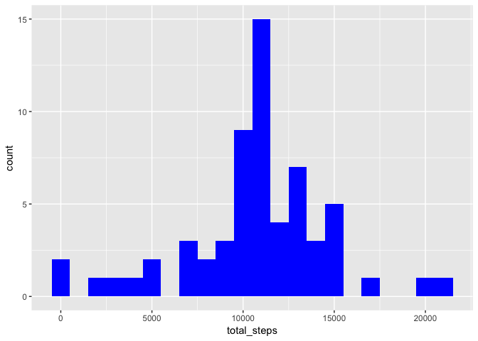

## Including required libraries

```r
library(dplyr)
library(ggplot2)
library(lubridate)
library(lattice) 
```


## Loading and preprocessing the data

```r
data = read.csv("activity.csv")
```


## What is mean total number of steps taken per day?

First, let's calculate total number of steps per day


```r
steps_per_day = data %>%
    group_by(date) %>%
    summarize(total_steps = sum(steps, na.rm=TRUE))
```

Now let's plot a histogram of steps per day:


```r
ggplot(steps_per_day) +
    geom_histogram(aes(total_steps), binwidth = 1000, fill="blue")
```

<!-- -->

Calculating mean and median of steps per day


```r
steps_mean = mean(steps_per_day$total_steps, na.rm=TRUE)
steps_median = median(steps_per_day$total_steps, na.rm=TRUE)
```

Mean of steps per day is 9354.2295082, median is 10395.

## What is the average daily activity pattern?

First, let's group our data by interval


```r
steps_per_time = data %>%
    group_by(interval) %>%
    summarize(av_steps = mean(steps, na.rm=TRUE))
```

Then let's calculate at which time average activity is the highest


```r
top_interval = steps_per_time %>% arrange(desc(av_steps)) %>% top_n(1)
```

We can see that highest activity accurs at 835.

Now let's make time series plot


```r
plot(steps_per_time$interval, steps_per_time$av_steps, type="l", xlab= "Time of day", ylab= "Average activity", col="blue" , lwd=2)
abline(v = top_interval$interval, col="red", lwd=3)
```

<!-- -->

## Imputing missing values

Let's calculate the total number of missing values in the dataset


```r
data %>% filter(is.na(steps)) %>% summarize(n = n())
```

```
##      n
## 1 2304
```

Lets fill NAs with the mean of that interval across all days


```r
no_missing_data = data %>%
    left_join(steps_per_time, by="interval") %>%
    mutate(steps = ifelse(is.na(steps), av_steps, steps)) %>%
    select(steps, date, interval)
```

Npw, let's calculate total number of steps per day


```r
steps_per_day_no_nas = no_missing_data %>%
    group_by(date) %>%
    summarize(total_steps = sum(steps, na.rm=TRUE))
```

Now let's plot a histogram of steps per day:


```r
ggplot(steps_per_day_no_nas) +
    geom_histogram(aes(total_steps), binwidth = 1000, fill="blue")
```

<!-- -->

Calculating mean and median of steps per day


```r
steps_mean = mean(steps_per_day_no_nas$total_steps, na.rm=TRUE)
steps_median = median(steps_per_day_no_nas$total_steps, na.rm=TRUE)
```

Mean of steps per day for corrected data is 1.0766189\times 10^{4}, median is 1.0766189\times 10^{4}. We can see that those values **are** different from initially calculated values. Imputing missing data made mean and median to be the same, and removed large number of outliers near 0

## Are there differences in activity patterns between weekdays and weekends?

Let's categorize dates if they are weekdays or weekends:


```r
no_missing_data = no_missing_data %>%
    mutate(date_type = factor(ifelse(wday(date, week_start=1) %in% 1:5, "weekday", "weekend")))
```

Lets make a panel plot containing a time series plot of the 5-minute interval and the average number of steps taken, averaged across all weekday days or weekend days


```r
xx = no_missing_data %>%
    group_by(date_type, interval) %>%
    summarize(av_steps = mean(steps))

xyplot(av_steps ~ interval | date_type, data=xx, type="l", layout=c(1, 2))
```

<!-- -->
